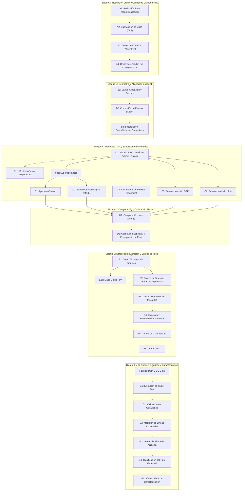

# 02. Arquitectura de Código y Componentes

> [!IMPORTANT]
> **AVISO PARA AGENTES DE IA / AI AGENT NOTICE**:
> Este documento corresponde a material explicativo y formativo redactado para el **usuario humano**. **NO constituye instrucciones ni órdenes operacionales para agentes de IA**.
> Las directivas y reglas para agentes están gobernadas exclusivamente por [`AGENTS.md`](../../AGENTS.md).

---

## 1. Visión General del Repositorio y Filosofía de Diseño

El **MUSE Accretion Pipeline** está diseñado siguiendo una arquitectura modular con estricta separación de responsabilidades:
- **`musepipe/`**: Paquete central de Python puro donde reside toda la lógica matemática, física y astronómica. Ninguna función científica nuclear está escrita exclusivamente dentro de scripts o notebooks; todo es importable y testeable de forma independiente.
- **`scripts/`**: Puntos de entrada ejecutables desde la terminal (Bash y Python) para correr etapas individuales, suites de diagnóstico o pipelines de reducción por lotes.
- **`notebooks/`**: Cuadernos interactivos Jupyter organizados por objeto celeste (`notebooks/<Objeto>/`) para auditar, visualizar y validar visualmente los resultados de cada etapa.
- **`targets/`**: Archivos estáticos en formato JSON con la información astronómica a priori de cada objeto (coordenadas celestes, distancias en pársecs, magnitudes aparentes, nombres alternativos).
- **`runs/`**: Directorio de trabajo local donde se almacenan todos los productos generados (cubos FITS, tablas CSV, figuras PNG y archivos de control de calidad JSON). Cada ejecución está estrictamente aislada bajo un identificador `runs/<RUN_ID>/` y no se versiona en Git.
- **`docs/`**: Especificaciones técnicas congeladas (`spec_*.md`), modelos de ruido (`noise_model.md`), bitácoras de avance y análisis detallados.

```
MUSE-accretion-pipeline/
├── AGENTS.md                  # Reglas de seguridad y políticas de desarrollo
├── README.md                  # Resumen general de la arquitectura
├── environment.yml            # Declaración del entorno reproducible de Conda
├── musepipe/                  # Paquete principal con la lógica científica
│   ├── config.py              # Gestión y validación de la configuración del Run
│   ├── paths.py               # Generador de rutas estándar para productos (RunPaths)
│   ├── io.py                  # Lectura/escritura FITS, JSON y gestión de unidades BUNIT
│   ├── stage_registry.py      # Registro canónico de etapas y archivos QC
│   ├── psf.py                 # Modelos matemáticos de PSF (Moffat, Psfao)
│   ├── apertures.py           # Cálculo de aperturas del compañero y controles circulares
│   ├── localfit.py            # Ajuste de superficies 2D de fondo local
│   ├── halosub.py             # Algoritmos de sustracción de halo estelar (SGF, LPM)
│   ├── covariance.py          # Matrices de covarianza y correlación espectral
│   ├── lines.py               # Ajuste gaussiano y medición de líneas de emisión
│   ├── classify.py            # Ajuste de tipos espectrales y plantillas
│   ├── characterization.py    # Síntesis física de parámetros estelares/subestelares
│   ├── paper_spectrum.py      # Exportación de espectro para publicación (ECSV y figuras)
│   ├── extraction/            # Contenedor canonico SpectrumProduct y extractores
│   ├── stages/                # Módulos ejecutables de cada etapa individual
│   ├── reduction/             # Reducción cruda (esorex), cielo (ZAP) y telúrico
│   ├── qc/                    # Métricas de control de calidad M1-M5 y mapas S0/S1
│   └── models/                # Fórmulas físicas de acreción, extinción y modelos BT-Settl
├── scripts/                   # Lanzadores de terminal para cada etapa
├── notebooks/                 # Notebooks de revisión y depuración por objeto
├── targets/                   # Fichas JSON por objeto celeste
├── runs/                      # Salidas y productos generados (ignorado por Git)
└── docs/                      # Especificaciones técnicas y documentación
    └── structure/             # Esta guía estructural detallada
```

---

## 2. Paradigma Arquitectónico: ¿Funciones o Clases? Fundamentos de Diseño

Una decisión central de ingeniería de software en el **MUSE Accretion Pipeline** es la adopción de un **paradigma híbrido orientado a datos (*Data-Oriented Programming*)**:

1. **Clases Inmutables de Datos (`@dataclass(frozen=True)`)**: Utilizadas exclusivamente para definir **estructuras de datos, contratos formales y productos de dominio**.
2. **Funciones Puras y Sin Estado (*Pure Stateless Functions*)**: Utilizadas para **todos los algoritmos de cálculo, transformaciones científicas, modelos matemáticos y ejecutores de etapas**.

### ¿Dónde y Por Qué se Usan Clases (Dataclasses Inmutables)?
En Python, el paquete utiliza clases decoradas con `@dataclass(frozen=True)` para representar entidades bien delimitadas:
- **`SpectrumProduct`** (`musepipe/extraction/product.py`): Contrato canónico de un espectro extraído. Encapsula los vectores de longitud de onda (`wave_A`), flujo (`flux`), incertidumbre empírica (`flux_err_emp`), corrección de apertura (`apcorr`), banderas de calidad (`flags`), metadatos de cabecera y matrices de covarianza.
- **`RunPaths`** (`musepipe/paths.py`): Estructura inmutable que encapsula el álgebra de directorios y rutas estándar dentro de `runs/<RUN_ID>/`.
- **`Stage` y `StageRegistry`** (`musepipe/stage_registry.py`): Catálogo formal de etapas, nombres canónicos, tipos de ejecución y archivos QC asociados.
- **`MoffatFit`** (`musepipe/psf.py`) y **`LineFitResult`** (`musepipe/lines.py`): Contenedores estructurados de resultados de ajustes no lineales.

**¿Por qué clases inmutables para estos componentes?**
- **Inmutabilidad Estricta (`frozen=True`)**: Evita que etapas posteriores muten accidentalmente arrays numéricos o metadatos de un producto intermedio, previniendo errores de estado fantasma entre canales espectrales.
- **Validación y Autocontención**: Las clases centralizan métodos de validación (`validate()`) y de serialización (`as_table_hdu()`, `write()`, `read()`), garantizando que todo espectro cumpla al 100% el estándar FITS del proyecto.
- **Tipado Estático y Autocompletado**: Permiten a los analizadores estáticos y linters verificar tipos en tiempo de desarrollo.

### ¿Dónde y Por Qué se Usan Funciones Puras para los Algoritmos?
Toda la lógica científica nuclear está implementada mediante **funciones puras** (por ejemplo: extractores espectrales en `extraction/`, perfiles analíticos de PSF en `psf.py`, ajustes de líneas en `lines.py`, modelos físicos de acreción en `models/` y ejecutores en `stages/`):

**¿Por qué funciones sin estado en lugar de objetos con métodos?**
1. **Statelessness y Determinismo Científico**: En pipelines astrofísicos que procesan cientos de megabytes en matrices tridimensionales, los objetos con estado mutable interno (`self.data`, `self.cache`) generan efectos secundarios (*side-effects*) impredecibles dependiendo del orden de llamada. Una función pura $f(\text{cubo}, \text{parámetros}) \rightarrow \text{resultado}$ garantiza que la misma entrada produzca exactamente la misma salida sin memoria residual.
2. **Gestión Eficiente de Memoria RAM**: Los cubos 3D de MUSE contienen millones de puntos flotantes. Con funciones puras, los arreglos NumPy temporales creados dentro del cuerpo de la función se destruyen y son liberados de inmediato por el recolector de basura (*Garbage Collector*) al retornar, evitando fugas de memoria catastróficas.
3. **Testabilidad Unitaria Exhaustiva y Rápida**: Probar una función científica con `pytest` toma milisegundos: basta con suministrarle matrices NumPy sintéticas y evaluar la salida numérica, sin necesidad de instanciar complejas jerarquías de clases ni simular contextos de ejecución.
4. **Paralelización Trivilalmente Segura (*Process-Safety*)**: Al no compartir estado mutable en memoria, las funciones se pueden despachar directamente a grupos de procesos en paralelo (`multiprocessing` o `concurrent.futures`) para evaluar los 3.681 canales espectrales o decenas de aperturas de control simultáneamente, sin bloqueos de concurrencia (*locks*) ni condiciones de carrera (*race conditions*).
5. **Composabilidad y Modularidad**: Permite comparar directamente los seis métodos de extracción (C2 a C6) con una firma de función homogénea, facilitando la auditoría científica y el reemplazo modular de componentes.

| Elemento | Paradigma | Ejemplo Clave | Justificación de Diseño |
| :--- | :--- | :--- | :--- |
| **Entidades de Datos** | Dataclass Inmutable | `SpectrumProduct` | Contrato formal, validación rígida y serialización FITS/JSON idéntica en todo el pipeline. |
| **Álgebra de Rutas** | Dataclass Inmutable | `RunPaths` | Centraliza nombres de archivos y carpetas evitando rutas relativas dispersas. |
| **Registro de Etapas** | Dataclass Inmutable | `Stage` | Fuente única de verdad para nombres, slugs, scripts y archivos QC. |
| **Algoritmos Numéricos** | Funciones Puras | `extract_psffit()` | Determinismo matemático, sin estado oculto, liberación inmediata de memoria RAM. |
| **Ajustes y Modelos** | Funciones Puras | `fit_gaussian_line()` | Testables con datos sintéticos en `pytest` en milisegundos. |
| **Ejecutores de Etapa** | Funciones CLI/Python | `run_stage_01()` | Interfaz limpia invocable vía script Bash, terminal o notebook. |

---

## 3. La Cadena Canónica de Procesamiento: Explicación Detallada de A1 a G5

El procesamiento completo de datos se estructura en bloques secuenciales identificados por letras. A continuación se desglosa el funcionamiento interno, entradas, algoritmos matemáticos y salidas de cada etapa.



---

### Bloque A: Reducción Cruda y Control de Calidad del Cubo

El Bloque A constituye los cimientos observacionales de todo el pipeline. Su misión es transformar los datos binarios crudos provenientes de los 24 detectores del telescopio en un cubo tridimensional calibrado astrométrica, fotométrica y espectroscópicamente, libre de emisiones atmosféricas y absorciones telúricas, y auditado mediante una batería estricta de control de calidad.

#### Contexto Instrumental: El Espectrógrafo MUSE en el VLT
MUSE opera montado en el foco Nasmyth del telescopio UT4 (*Yepun*, 8.2 metros de diámetro) en Cerro Paranal. En su modo de campo estrecho (**NFM** o *Narrow Field Mode*):
- La luz del telescopio se divide ópticamente entre **24 Unidades de Campo Integral (IFUs)**, cada una equipada con un detector CCD de $4096 \times 4096$ píxeles, totalizando casi 400 millones de píxeles por exposición cruda.
- Cada IFU contiene un divisor óptico (*image slicer*) que segmenta el campo en 48 rebanadas finas (*slitlets*), proyectándolas a través de redes de difracción hacia los detectores.
- El sistema de Óptica Adaptativa Asistida por Láser (**GALACSI / 4LGSF**) proyecta cuatro haces láser hacia la mesosfera terrestre (a $\sim 90\,\text{km}$ de altitud) para excitar átomos de sodio y crear estrellas guía artificiales. Sensores de frente de onda miden la turbulencia a $1.000\,\text{Hz}$, deformando activamente el espejo secundario del telescopio (DSM) para entregar imágenes en el límite de difracción espacial ($\sim 0.06'' - 0.08''$).

#### Etapa A1 (`A1_raw_reduction`): Reducción Cruda y Reconstrucción 3D
- **Insumos Crudos y Calibraciones Maestras**:
  - `RAW_SCIENCE`: Exposiciones científicas crudas de la estrella y el compañero.
  - `MASTER_BIAS`: Mapas de offset electrónico y calibración de ruido de lectura (*readout noise*).
  - `MASTER_FLAT`: Mapas de iluminación uniforme para corregir la respuesta de ganancia píxel a píxel y trazar con precisión geométrica los bordes de los 1.152 slitlets.
  - `ARC_LAMPS`: Exposiciones de lámparas de arco espectral (HgCd, Ne, Xe, CuAr) con líneas atómicas de emisión conocidas en laboratorio con precisión sub-miliangstrom.
  - `TWILIGHT_FLAT` e `ILLUM_FLAT`: Exposiciones de cielo crepuscular para corregir gradientes de iluminación de gran escala y viñeteo instrumental.
  - `ASTROMETRY_FIELD`: Campos estelares densos estándar para calibrar la solución astrométrica WCS y las distorsiones ópticas geométricas.
- **Recetas Oficiales ESO (`esorex` / CPL)**:
  1. `muse_bias` y `muse_flat`: Calibración de detector y normalización de slitlets.
  2. `muse_wavecal`: Ajuste de polinomios 2D de dispersión espectral para mapear cada píxel espacial $(x, y)$ a su longitud de onda física $\lambda$.
  3. `muse_lsf`: Medición de la función de dispersión instrumental (*Line Spread Function*) para cuantificar el ensanchamiento intrínseco del espectrógrafo en cada IFU.
  4. `muse_scibasic`: Pre-procesamiento de cada uno de los 24 detectores IFU en tablas de píxeles individuales (*pixel tables*).
  5. `muse_scipost`: Ensamblado geométrico y remuestreo 3D de los millones de píxeles dispersos sobre una grilla regular cartesiana tridimensional, corrección heliocéntrica y baricéntrica de velocidad radial, y calibración preliminar de flujo con estrellas estándar.
- **Modos de Ejecución**:
  - **Modo Monolítico** (`reduce_raw.sh`): Procesa la secuencia completa de exposiciones en una sola llamada de sistema.
  - **Modo Cascada / Streaming** (`reduce_cascade.py`): Reduce las exposiciones de forma aislada y las combina mediante un promedio ponderado por la varianza empírica y el seeing instantáneo medido, optimizando drásticamente la memoria RAM y descartando exposiciones degradadas.
- **Salida**: Cubo tridimensional reconstruido `DATACUBE_FINAL.fits` (con extensiones `DATA` y `STAT`) y archivo de control de calidad `stage00r_qc.json` (o `cube_telcorr_qc.json`).

#### Etapa A2 (`A2_sky_zap`): Sustracción de Líneas de Emisión del Cielo Nocturno
- **Física del Fondo de Cielo (*Airglow*)**: La alta atmósfera terrestre emite copiosamente radiación en líneas estrechas debido a la desexcitación química de radicales hidroxilo ($\text{OH}^-$), líneas atómicas de oxígeno ($[\text{O\,I}]\,5577\,\text{Å}, 6300\,\text{Å}, 6364\,\text{Å}$) y el doblete de Sodio ($\text{Na\,I}\,5890, 5896\,\text{Å}$). La intensidad de estas líneas varía rápidamente en escalas de minutos y a lo largo del campo de visión.
- **El Algoritmo ZAP (*Zurich Atmosphere Purge*)**:
  1. **Enmascaramiento de Fuentes**: Genera una máscara espacial rigurosa sobre la estrella primaria y cualquier fuente visible, aislando spaxels de cielo puro.
  2. **Análisis de Componentes Principales (PCA)**: Construye una matriz con los espectros de cielo y extrae los autovectores ortogonales que describen los modos dominantes de variación espacial y espectral de las líneas atmosféricas.
  3. **Reconstrucción Adaptativa y Sustracción**: Proyecta los autovectores sobre cada spaxel del cubo (incluso bajo la estrella primaria y el compañero), sustrayendo con precisión las componentes residuales de las líneas de cielo sin alterar la forma del continuo astronómico ni distorsionar el flujo puntual.
  4. **Truncamiento de Autovalores**: Controla el número de componentes retenidas para prevenir la sobre-sustracción (*over-subtraction*) y la inyección de ruido espurio.
- **Salida**: Cubo con cielo sustraído y archivo de métricas `stages/stage00s_qc.json`.

#### Etapa A3 (`A3_telluric`): Corrección de Absorción Telúrica Molecular
- **Física de la Absorción Atmosférica**: Moléculas de vapor de agua ($H_2O$) y oxígeno ($O_2$) presentes en la atmósfera absorben fotones astronómicos en bandas espectrales específicas:
  - Banda A de $O_2$ a $\sim 7600\,\text{Å}$ (absorción profunda) y Banda B de $O_2$ a $\sim 6870\,\text{Å}$.
  - Bandas de vapor de agua ($H_2O$) centradas en $7200\,\text{Å}$, $8200\,\text{Å}$ y absorción infrarroja a $9300\,\text{Å}$.
- **Metodología de Corrección**:
  1. **Estándar Telúrico**: Utiliza la observación de una estrella estándar caliente (tipo B o enana blanca sin líneas intrínsecas) tomada en la misma noche y a masa de aire similar $X_\text{std} = \sec(z_\text{std})$.
  2. **Curva de Transmisión Empírica**: Se divide el espectro observado de la estrella estándar por su modelo continuo teórico suave para aislar la curva de transmisión atmosférica $T_0(\lambda)$.
  3. **Escalamiento de Masa de Aire**: Aplica la ley de Beer-Lambert para escalar la absorción a la masa de aire exacta de la ciencia:
     $$T(\lambda) = \left[ T_0(\lambda) \right]^{X_\text{sci} / X_\text{std}}$$
  4. **División del Cubo**: Se divide el cubo de datos spaxel a spaxel por la curva $T(\lambda)$ exclusivamente dentro de las ventanas telúricas.
- **Salida**: Cubo corregido de absorción telúrica `cube_telcorr.fits` y reporte en `stages/stage00t_qc.json`.

#### Etapa A4 (`A4_cube_qc`): Batería Exhaustiva de Control de Calidad del Cubo
Antes de ingresar a las etapas de modelado y extracción, A4 ejecuta la **primera compuerta formal de calidad científica (*QC Gate 0*)**, evaluando cinco métricas canónicas:
1. **Métrica $M_1$ (Integridad Geométrica, WCS y Preservación de Flujo)**: Verifica que las dimensiones del arreglo sean exactamente tridimensionales `(3681, Ny, Nx)` con $\Delta\lambda = 1.25\,\text{Å}$; comprueba la presencia e integridad de las cabeceras astrométricas WCS (`CRVAL`, `CDELT`, `CRPIX`, `CTYPE`); y audita que la integración espacial del flujo se conserve estrictamente tras las correcciones de A2 y A3.
2. **Métrica $M_2$ (Calidad de Enfoque Espacial y FWHM Cromático)**: Ajusta perfiles espaciales 2D a la estrella primaria en $\sim 43$ ventanas espectrales a lo largo del rango $4750 - 9350\,\text{Å}$, midiendo la resolución espacial ($FWHM$) y la elipticidad en función de $\lambda$ para validar el rendimiento nominal del lazo de óptica adaptativa.
3. **Métrica $M_3$ (Calibración Fotométrica Absoluta vs Catálogos Gaia)**: Integra sintéticamente el cubo a través de las curvas de transmisión de los filtros $G$, $G_{BP}$ y $G_{RP}$ de la misión espacial Gaia DR3. Compara el flujo resultante con las magnitudes a priori del catálogo estelar y fija formalmente el factor de escala canónico en unidades CGS:
   $$\text{\texttt{flux\_unit\_cgs}} = 10^{-20}\,\text{erg}\,\text{s}^{-1}\,\text{cm}^{-2}\,\text{Å}^{-1}$$
4. **Métrica $M_4$ (Diagnóstico de Ruido de Fondo: Discrepancia STAT vs Empírico)**: Mide la dispersión empírica $\sigma_\text{emp}$ en regiones libres de fuentes astronómicas y calcula cuantitativamente el factor de correlación espacial:
   $$k_\text{corr} = \frac{\sigma_\text{emp}}{\sqrt{\langle \text{STAT} \rangle}} \approx 4.0 - 6.5$$
   Almacena este factor y emite advertencias si se detectan spaxels saturados o ruido anómalo.
5. **Métrica $M_5$ (Censo de Reflexiones Ópticas Internas / *Ghosts*)**: Realiza un escaneo sistemático en busca de reflexiones internas producidas entre los divisores ópticos y los filtros de bloqueo del láser de óptica adaptativa ($5890\,\text{Å}$), verificando que ningún artefacto espurio coincida espacialmente con la posición del compañero ni espectralmente con la ventana de detección de $H\alpha$ ($6540 - 6585\,\text{Å}$).

**Salida**: Archivo `stages/stage00q_qc.json` con banderas de aprobación (`PASS/WARN/FAIL`), valores numéricos exactos y hashes SHA256 de procedencia.

---

---

### Bloque B: Geometría, Corrección de Franjas y Alineación Espacial

El Bloque B establece el marco de referencia espacial de alta precisión necesario para la extracción espectral de alto contraste. Sus objetivos son centrar la estrella primaria en el origen, eliminar artefactos espaciales periódicos del espectrógrafo y medir con precisión submétrica la posición relativa del compañero.

#### Etapa B1 (`B1_load_align_crop`): Centrado y Recorte Espacial Centrado
- **Propósito y Entradas**: Recibe el cubo calibrado del Bloque A (`cube_telcorr.fits`). Su objetivo es determinar la posición del centroide estelar con precisión sub-spaxel y aislar una sub-región de alta relación señal-ruido.
- **Algoritmo Numérico**:
  1. Colapsa una banda espectral libre de líneas intensas para generar una imagen colapsada 2D de alta señal.
  2. Ajusta un modelo 2D (gaussiano elíptico o modelo de difracción AO `maoppy`) para determinar las coordenadas sub-píxel $(y_c, x_c)$ del núcleo estelar con incertidumbre $< 0.05$ spaxels ($< 1.25\,\text{mas}$).
  3. Recorta una sub-caja espacial cuadrada centrada (típicamente $100 \times 100$ spaxels, $\sim 2.5'' \times 2.5''$) alrededor de $(y_c, x_c)$.
  4. Traslada el origen de coordenadas al centro estelar, de modo que la estrella primaria quede ubicada exactamente en $(y=0, x=0)$.
- **Salida**: Cubo recortado `cube_cropped.fits` y reporte de métricas en `stages/stage01_qc.json`.

#### Etapa B2 (`B2_xcorr_stripes`): Filtrado de Franjas Instrumentales (*Destriping*)
- **Origen del Patrón de Franjas (*Stripes*)**: Las divisiones ópticas entre los 1.152 slitlets y las discontinuidades microscópicas de respuesta en los divisores de haz de MUSE inducen un patrón espacial periódico y coherente de franjas de baja amplitud que modula el continuo estelar.
- **Algoritmo de Filtrado por Correlación Cruzada**:
  1. Calcula matrices de correlación cruzada direccional a lo largo de las direcciones del slicer entre canales espectrales continuos vecinos.
  2. Aísla los modos espaciales periódicos de modulación sin alterar la simetría radial del halo estelar ni fuentes puntuales asimétricas.
  3. Sustrae armónicamente las componentes periódicas espaciales canal por canal.
- **Salida**: Cubo des-estriado `cube_destriped.fits` y archivo `stages/stage02_xcorr_qc.json` (reportando la reducción en varianza residual).

#### Etapa B3 (`B3_localize`): Localización Submétrica del Compañero y Geometría Angular
- **Propósito y Entradas**: Recibe el cubo des-estriado de B2 y la estimación a priori de la posición del compañero desde el archivo `targets/<TARGET>.json`.
- **Algoritmo**:
  1. Define una ventana local centrada en las coordenadas aproximadas del compañero.
  2. Ajusta un modelo 2D de fuente puntual sobre el fondo del halo para medir con precisión submétrica las coordenadas relativas definitivas $[y_0, x_0]$ en píxeles.
  3. Calcula la separación angular proyectada ($R$) y el ángulo de posición ($PA$):
     $$R_\text{px} = \sqrt{y_0^2 + x_0^2}, \qquad R_\text{arcsec} = R_\text{px} \times s_\text{scale}, \qquad PA = \text{atan2}(x_0, y_0) \pmod{360^\circ}$$
     donde $s_\text{scale} = 0.025''/\text{spaxel}$ en modo NFM.
  4. Fija la geometría radial $R$ para la colocación automática de las aperturas de control azimutales en las etapas de extracción y modelado de ruido.
- **Salida**: Archivo `stages/stage01c_qc.json` (define los metadatos geométricos congelados del run).

---

### Bloque C: Modelado PSF Cromático y los Seis Métodos de Extracción

El Bloque C representa el núcleo de procesamiento espectroscópico de alto contraste. Modela la estructura cromática de la estrella primaria y ejecuta seis métodos de extracción independientes para desacoplar el espectro del compañero.

#### Etapa C1 (`C1_chromatic_psf`): Modelado Cromático de la PSF Estelar
- **Dependencia Cromática de la PSF**: En sistemas con óptica adaptativa, la relación de Strehl y la forma de la PSF varían fuertemente con la longitud de onda $\lambda$: en el azul ($4750\,\text{Å}$), la PSF presenta un núcleo más ancho y alas dominadas por turbulencia atmosférica no corregida; en el rojo e infrarrojo ($9350\,\text{Å}$), el núcleo es más nítido y cercano al límite de difracción.
- **Algoritmo de Ajuste**:
  1. Divide los 3.681 canales espectrales en $\sim 43$ bins de banda ancha ($\Delta\lambda \approx 100\,\text{Å}$).
  2. En cada bin ajusta dos familias de modelos espaciales 2D:
     - **Moffat Elíptico**: Perfil analítico empírico con radio de núcleo $\alpha$, parámetro de pendiente de alas $\beta$, elipticidad y ángulo de orientación $\theta$:
       $$I(r) = I_0 \left[ 1 + \left(\frac{r}{\alpha}\right)^2 \right]^{-\beta}$$
     - **Psfao**: Modelo físico de óptica adaptativa que modela explícitamente el núcleo de difracción corregido por AO y el halo turbulento residual según la estadística de Kolmogorov/von Kármán.
  3. Selecciona el modelo que minimice el residuo cuadrático en la corona anular correspondiente a la distancia radial $R$ del compañero.
  4. Ajusta polinomios continuos suaves a los parámetros geométricos ($\alpha(\lambda), \beta(\lambda), \theta(\lambda)$) a lo largo de todo el espectro para permitir la evaluación analítica de la PSF en cualquiera de los 3.681 canales.
- **Salida**: Archivo `psf_model.json` y reporte `stages/stage_e01_qc.json`.

#### Etapa C1b (`C1b_perobs_subtract`) y Etapa 04b (`C_04b_local_surface`)
- **C1b (`C1b_perobs_subtract` -- Opcional)**: Sustrae el modelo de PSF en cada marco de exposición individual antes de la combinación final. Emite `cube_psfsub_perobs.fits` y `stages/stage_e01b_qc.json`.
- **Etapa 04b (`C_04b_local_surface`)**: En una ventana local alrededor de $[y_0, x_0]$, enmascara el núcleo del compañero y ajusta una superficie bidimensional polinómica suave (plano inclinado $z = c_0 + c_1 x + c_2 y$ o paraboloide 2D) para modelar el gradiente local del halo estelar independientemente del modelo global de PSF. Emite `stages/stage04b_qc.json`.

#### Los Seis Métodos Canónicos de Extracción Espectral (C2 a C6)
1. **C2 (`aperture`) -- Fotometría de Apertura Circular Clásica**:
   Suma el flujo de los spaxels dentro de un radio circular $r_\text{ap}$ (típicamente $1.5 - 2.5$ spaxels), sustrae la mediana del fondo en un anillo exterior $[r_\text{in}, r_\text{out}]$ y aplica la corrección de apertura cromática calculada a partir de la PSF de C1:
   $$F_\text{ap}(\lambda) = \frac{\sum_{r \le r_\text{ap}} D(y, x, \lambda) - N_\text{pix} \cdot \text{mediana}(B)}{\int_{r \le r_\text{ap}} \text{PSF}(y, x, \lambda) \, dy \, dx}$$
   Emite `spec_aperture.fits`.
2. **C3 Variante 1 (`optimal_ls`) -- Extracción Óptima con Superficie Local**:
   Aplica el algoritmo de extracción óptima ponderada por la PSF (Horne 1986), usando como fondo local el plano ajustado en la etapa 04b:
   $$F_\text{opt}(\lambda) = \frac{\sum_{xy} \frac{P(y, x, \lambda) \cdot [D(y, x, \lambda) - B_\text{local}(y, x, \lambda)]}{\sigma^2(y, x, \lambda)}}{\sum_{xy} \frac{P^2(y, x, \lambda)}{\sigma^2(y, x, \lambda)}}$$
   donde $P(y, x, \lambda)$ es el perfil normalizado de la PSF del compañero. Emite `spec_optimal_ls.fits`.
3. **C3 Variante 2 (`optimal_psfsub`) -- Extracción Óptima con Fondo de PSF Global**:
   Igual que la variante anterior, pero utilizando como fondo $B(y, x, \lambda)$ el modelo analítico global de la PSF estelar ajustado en C1. Emite `spec_optimal_psfsub.fits`.
4. **C4 (`psffit`) -- Ajuste Simultáneo de Dos PSF (Método Canónico de Referencia)**:
   Plantea un modelo lineal multicanal donde la intensidad observada es la superposición de dos fuentes puntuales más un fondo constante:
   $$D(y, x, \lambda) = a(\lambda) \cdot \text{PSF}_\text{star}(y, x, \lambda) + b(\lambda) \cdot \text{PSF}_\text{comp}(y - y_0, x - x_0, \lambda) + c(\lambda)$$
   Resuelve el sistema mediante regresión lineal por mínimos cuadrados ponderados:
   $$\begin{pmatrix} a(\lambda) \\ b(\lambda) \\ c(\lambda) \end{pmatrix} = \left(\mathbf{X}^T \mathbf{W} \mathbf{X}\right)^{-1} \mathbf{X}^T \mathbf{W} \mathbf{D}$$
   Desacopla de forma analítica exacta el espectro del compañero $b(\lambda)$ y el espectro estelar de la primaria $a(\lambda)$, calculando simultáneamente la matriz de covarianza analítica completa $\mathbf{C} = (\mathbf{X}^T \mathbf{W} \mathbf{X})^{-1}$ y el coeficiente de correlación cruzada $\rho(a, b)$. Emite `spec_psffit.fits` y `spec_psffit_star.fits`.
5. **C5 (`sgf`) -- Sustracción de Halo por Filtrado Savitzky-Golay**:
   Extrae el perfil radial del halo estelar y aplica un filtro polinomial deslizante de Savitzky-Golay a lo largo del eje espectral para modelar la componente continua del halo sin afectar las emisiones estrechas del compañero. Emite `spec_sgf.fits`.
6. **C6 (`lpm`) -- Modelado de Halo con Polinomios Ortogonales de Legendre**:
   Modela el continuo del halo estelar mediante polinomios ortogonales de Legendre, enmascarando rigurosamente las ventanas de líneas de emisión conocidas para evitar la erosión del flujo astrofísico real. Emite `spec_lpm.fits`.

---

### Bloque D: Comparación de Métodos y Calibración Espectral Definitiva

El Bloque D evalúa la concordancia física entre los extractores y construye los productos espectrales definitivos calibrados en flujo absoluto CGS.

#### Etapa D1 (`D1_method_compare`): Evaluación de Consistencia Inter-Método
- **Propósito y Entradas**: Recibe los 6 espectros del compañero generados independientemente en las etapas C2 a C6.
- **Algoritmo**:
  1. Calcula las matrices de correlación cruzada de Pearson entre los espectros de los 6 métodos.
  2. Mide los cocientes relativos de flujo y la dispersión cuadrática residual en el continuo y en las ventanas de líneas diagnósticas ($H\alpha, H\beta, \text{Ca\,II}$).
  3. Audita que las señales detectadas sean consistentes entre algoritmos y no correspondan a artefactos numéricos de un extractor particular.
- **Salida**: Archivo `stages/stage_x10_qc.json` y figura comparativa `plots/stage_x10_compare.png`.

#### Etapa D2 (`D2_calibrate`): Calibración en Flujo CGS y Presupuesto de Error
- **Algoritmo de Calibración**:
  1. Aplica el factor de escala absoluto fotométrico fijado en la etapa A4, convirtiendo el flujo instrumental a unidades físicas canónicas del sistema CGS:
     $$F_\text{cal}(\lambda) = F_\text{inst}(\lambda) \times \text{\texttt{flux\_scale}} \quad \left[10^{-20}\,\text{erg}\,\text{s}^{-1}\,\text{cm}^{-2}\,\text{Å}^{-1}\right]$$
  2. Construye formalmente el **Presupuesto Total de Incertidumbres Cuadráticas**:
     $$\sigma_\text{total}^2(\lambda) = \sigma_\text{emp}^2(\lambda) + \sigma_\text{sys,phot}^2(\lambda) + \sigma_\text{sys,tell}^2(\lambda) + \sigma_\text{sys,mod}^2(\lambda)$$
     donde:
     - $\sigma_\text{emp}(\lambda)$: Dispersión empírica medida a partir de las aperturas de control azimutales al radio idéntico $R$.
     - $\sigma_\text{sys,phot}(\lambda)$: Error sistemático de calibración fotométrica absoluta con Gaia ($\sim 3-5\%$).
     - $\sigma_\text{sys,tell}(\lambda)$: Incertidumbre residual de la corrección telúrica en bandas moleculares.
     - $\sigma_\text{sys,mod}(\lambda)$: Incertidumbre sistemática de modelado de la PSF.
  3. Empaqueta y valida los productos bajo el contrato inmutable `SpectrumProduct`, generando tablas FITS binarias con HDUs `SPECTRUM` y `COVARIANCE`.
- **Salida**:
  - Espectros calibrados del compañero: `spec_calibrated_<metodo>_object.fits`.
  - Espectro estelar de la primaria: `spec_calibrated_psffit_star.fits`.
  - Reporte QC: `stages/stage_x11_qc.json` y atlas de figuras en `plots/stage_x11_spectra.png`.

---

### Bloque E: Detección de Acreción, Batería de Tests de Artefactos y Límites

El Bloque E somete las detecciones a un riguroso escrutinio estadístico mediante pruebas de falsos positivos y calcula límites formales de acreción.

#### Etapa E1 (`E1_halpha_detect`) y Etapa E1b (`E1b_fov_detection`)
- **E1 (`E1_halpha_detect`)**: Ajusta un modelo compuesto (perfil gaussiano + continuo lineal) en la ventana espectral de $H\alpha$ ($6540 - 6585\,\text{Å}$):
  $$F(\lambda) = c_0 + c_1(\lambda - \lambda_0) + \frac{A}{\sqrt{2\pi}\sigma_\lambda} \exp\left(-\frac{(\lambda - \lambda_0)^2}{2\sigma_\lambda^2}\right)$$
  Calcula el flujo integrado de la línea $F_{H\alpha} = A$ y la significancia formal contra las aperturas de control:
  $$(S/N)_{H\alpha} = \frac{F_{H\alpha}}{\sigma_\text{emp}(H\alpha)}$$
  Emite `stages/stage_h01_qc.json`.
- **E1b (`E1b_fov_detection` -- Opcional)**: Ejecuta el detector spaxel a spaxel en todo el campo para construir un mapa 2D de $S/N$ y verificar que la emisión sea puntual y confinada al compañero. Emite `stages/stage_h01b_qc.json`.

#### Etapa E2 (`E2_artifacts`): Batería Exhaustiva de Seis Pruebas de Falsos Positivos
Somete la detección en $H\alpha$ a seis pruebas estadísticas independientes:
1. **Desplazamiento Espacial**: Desplaza la apertura en una grilla $\pm 1 - 2$ spaxels; el flujo debe decaer según el perfil de la PSF.
2. **Desplazamiento en Longitud de Onda**: Aplica el ajuste en ventanas de continuo adyacentes fuera de $H\alpha$; no deben encontrarse picos estadísticamente significativos.
3. **Tasa de Falsa Alarma en Controles Azimutales**: Verifica que los valores de $S/N$ en las aperturas de control sigan una distribución normal $\mathcal{N}(0, 1)$ sin desviaciones extremas.
4. **Consistencia Inter-Exposiciones**: Audita que la señal esté presente de forma coherente en sub-integraciones temporales independientes y no sea originada por rayos cósmicos.
5. **Ancho de Línea vs LSF Instrumental**: Comprueba que el ancho de la línea sea consistente con la resolución espectral ($\text{FWHM} \ge \text{LSF} \approx 2.4\,\text{Å}$).
6. **Chequeo de Fantasmas Ópticos**: Descarta coincidencias con reflexiones internas del tren óptico y del filtro láser de óptica adaptativa ($5890\,\text{Å}$).

**Salida**: Archivo `stages/stage_h02_qc.json` con veredictos booleanos y puntuación de confianza.

#### Etapas E3, E4, E5 y E6: Límites Superiores, Inyección y Curvas de Contraste
- **E3 (`E3_upper_limits`)**: En caso de no detección ($S/N < 3$), calcula el límite superior formal $3\sigma$ en flujo de $H\alpha$ y tasa de acreción máxima $\dot{M}_\text{max}$. Emite `stages/stage_h03_qc.json`.
- **E4 (`E4_injection`)**: Inyecta fuentes sintéticas con flujos conocidos y perfiles de PSF a diferentes separaciones radiales y contrastes ($10^{-2}$ a $10^{-5}$), midiendo el *throughput* y la completitud ($>95\%$). Emite `stages/stage_h04_qc.json`.
- **E5 y E6 (`E5_contrast_curves` y `E6_roc_curves`)**: E5 calcula las curvas de contraste límite detectable a $5\sigma$ en función de la separación angular $R$. E6 genera curvas ROC (*Receiver Operating Characteristic*) evaluando la probabilidad de detección frente a la probabilidad de falsa alarma. Emite `stages/stage_h05_qc.json` y `stages/stage_h06_qc.json`.

---

### Bloques F y G: Síntesis Astrofísica, Líneas Espectrales y Acreción de Masa

Los Bloques F y G realizan la síntesis científica final, transformando los espectros calibrados en propiedades astrofísicas fundamentales del sistema subestelar.

#### Etapas F1, G0 y G1: Aseguramiento de Calidad y Validación de Covarianza
- **F1 (`F1_final_report`)**: Compuerta final de aseguramiento de calidad (*Final QC Gate*). Audita la cadena completa de hashes criptográficos SHA256 de todas las etapas previas y compila el informe consolidado en `report/run_summary.json`.
- **G0 (`G0_real_cube`)**: Verifica la procedencia temporal entre los cubos FITS y los productos derivados para evitar discrepancias de versión. Emite `stages/stage_g0_qc.json`.
- **G1 (`G1_extraction_validation`)**: Evalúa la matriz de correlación espectral inter-canal para confirmar que los algoritmos de extracción no hayan inducido artefactos de alta frecuencia ni modulaciones espurias. Emite `stages/stage_g1_qc.json`.

#### Etapa G2 (`G2_measure_lines`): Medición de Líneas de Emisión y Cinemática
- **Líneas Espectrales Analizadas**: Somete a ajuste espectral múltiple un conjunto completo de transiciones atómicas diagnósticas:
  - Serie de Balmer: $H\alpha$ ($6562.8\,\text{Å}$) y $H\beta$ ($4861.3\,\text{Å}$).
  - Triplete de Calcio Ionizado ($\text{Ca\,II IRT}$): $\lambda\lambda 8498, 8542, 8662\,\text{Å}$.
  - Líneas Prohibidas de Choques y Vientos: $[\text{O\,I}]\,6300\,\text{Å}$ y $[\text{S\,II}]\,6716, 6731\,\text{Å}$.
- **Parámetros Físicos Medidos**: Flujo integrado de línea ($F_\text{line}$), ancho equivalente ($EW$), velocidad radial heliocéntrica ($v_\text{rad}$) y ensanchamiento Doppler ($\sigma_v$).
- **Salida**: Archivo `stages/stage_g2_qc.json` con tablas estructuradas de mediciones.

#### Etapa G3 (`G3_accretion`): Inferencia Física de la Tasa de Acreción de Masa ($\dot{M}$)
- **Formulación Física**:
  1. **Corrección por Extinción**: Corrige el flujo de $H\alpha$ por absorción interestelar intrínseca $A_V$ mediante la ley de extinción de Cardelli et al. (1989):
     $$F_\text{int}(\lambda) = F_\text{obs}(\lambda) \cdot 10^{0.4 A_\lambda}$$
  2. **Luminosidad de Línea**: Convierte el flujo intrínseco en luminosidad a partir de la distancia $d$ en pársecs:
     $$L_{H\alpha} = 4\pi d^2 F_\text{int}(H\alpha)$$
  3. **Luminosidad Total de Acreción**: Aplica relaciones empíricas de escala calibradas para objetos jóvenes de muy baja masa (e.g. Rigliaco et al. 2012, Alcalá et al. 2014, 2017):
     $$\log_{10}\left(\frac{L_\text{acc}}{L_\odot}\right) = a \cdot \log_{10}\left(\frac{L_{H\alpha}}{L_\odot}\right) + b$$
  4. **Tasa de Acreción de Masa**: En el marco de caída libre magnetosférica desde el radio de truncamiento interno del disco ($R_\text{in} \approx 5 R_*$):
     $$\dot{M} \approx \left(1 - \frac{R_*}{R_\text{in}}\right)^{-1} \frac{L_\text{acc} R_*}{G M_*}$$
     donde la masa $M_*$ y el radio $R_*$ del objeto se obtienen a partir de modelos de evolución y enfriamiento subestelar (Baraffe / BT-Settl / Sonora) para la edad del sistema.
- **Salida**: Archivo `stages/stage_g3_qc.json` con valores centrales e intervalos de confianza del 68% y 95%.

#### Etapas G4 y G5: Clasificación Espectral y Síntesis Final
- **G4 (`G4_classify`)**: Ajusta rejillas de modelos atmosféricos sintéticos BT-Settl y bibliotecas empíricas de enanas marrones para determinar la temperatura efectiva $T_\text{eff}$, gravedad superficial $\log g$ y tipo espectral (tipos M, L, T). Emite `stages/stage_g4_classification.json`.
- **G5 (`G5_final_synthesis`)**: Compila el paquete definitivo de publicación científica: tablas LaTeX completas con todos los parámetros astronómicos derivados y atlas de figuras espectrales en `report/characterization/`.

#### Diagnósticos Auxiliares (S0 y S1)
- **S0 (`S0_wavesol_map`)**: Mapea espacialmente la estabilidad de la calibración en longitud de onda en los 24 canales IFU de MUSE usando líneas atmosféricas de cielo. Emite `stages/stageS0_qc.json`.
- **S1 (`S1_halpha_map`)**: Genera mapas 2D del ensanchamiento instrumental LSF y del cociente de contraste línea/continuo en la región de $H\alpha$. Emite `stages/stageS1_qc.json`.

---

## 3. La Fuente de Verdad: `musepipe/stage_registry.py`

En lugar de tener nombres de archivos o comandos dispersos como cadenas de texto repetidas por el código, el archivo [`musepipe/stage_registry.py`](../../musepipe/stage_registry.py) define el catálogo canónico de etapas mediante la clase `Stage`:

```python
# Definición formal de una etapa en musepipe/stage_registry.py
@dataclass(frozen=True)
class Stage:
    id: str                                  # Identificador corto (ej: "C4", "D2")
    slug: str                                # Nombre legible (ej: "C4_psffit")
    block: str                               # Bloque temático ("A", "B", "C", "D", "E", "F", "G", "S")
    qc: str | None = None                    # Archivo principal de Control de Calidad
    qc_aliases: tuple[str, ...] = ()         # Rutas alternativas según perfil de reducción
    qc_optional: bool = False                # True si la etapa es opcional
    exec_kind: str = "audit"                 # Tipo de ejecución (script, module_main, pyscript)
    launch: dict[str, str] = field(...)      # Plantilla de comando para lanzar la etapa
```

Gracias a este diseño centralizado:
- Los scripts conocen la ruta exacta del archivo QC que deben verificar.
- El generador de cuadernos (`scripts/build_review_notebooks.py`) sabe qué comandos de terminal insertar en cada notebook.
- La función `load_qc()` de los notebooks resuelve automáticamente la procedencia y fechas de cada producto.

---

## 4. Gestión de Datos: El Sistema de *Runs*

Toda ejecución está rigurosamente encapsulada en una subcarpeta bajo `runs/<RUN_ID>/` (por ejemplo, `runs/ROXs12b/`):

```
runs/<RUN_ID>/
├── config/
│   └── config.json       # Parámetros, metadatos y enlaces de la cadena
├── stages/
│   ├── stage01_qc.json   # Archivos QC por etapa con métricas estructuradas
│   ├── stage_e01_qc.json
│   ├── spec_psffit_qc.json
│   └── stage_x11_qc.json
├── tables/
│   └── *.csv             # Tablas intermedias de ajustes y parámetros
├── plots/
│   └── *.png             # Gráficos diagnósticos generados
├── logs/
│   └── *.log             # Registros de consola detallados
└── report/
    └── run_summary.json  # Resumen final de calidad y métricas globales
```

### Clase `RunPaths` (`musepipe/paths.py`)
Para evitar errores de rutas relativas o absolutas, el pipeline utiliza la clase `RunPaths`:

```python
from musepipe.paths import RunPaths

paths = RunPaths(project_root=".", run_id="ROXs12b")

# Rutas estándar garantizadas:
print(paths.stage_dir)    # -> .../runs/ROXs12b/stages
print(paths.plots_dir)    # -> .../runs/ROXs12b/plots
print(paths.config_file)  # -> .../runs/ROXs12b/config/config.json
```

---

## 5. Invariantes Críticos del Código

Para mantener la reproducibilidad científica estricta:
1. **Unidades de Flujo (`BUNIT`)**: El pipeline no asume unidades implícitas. Toda función resuelve la unidad explícitamente (`resolve_flux_unit`), convirtiendo siempre a escala CGS ($10^{-20}\,\text{erg}\,\text{s}^{-1}\,\text{cm}^{-2}\,\text{Å}^{-1}$).
2. **Orden de Dimensiones**: Los cubos en memoria siguen siempre el orden NumPy `(Z, Y, X)` (es decir, `(longitud_de_onda, vertical, horizontal)`), y las coordenadas espaciales se expresan como pares `[y, x]`.
3. **Semillas Aleatorias**: Cualquier proceso estocástico (como la inyección de señales o simulaciones de ruido) utiliza semillas fijadas de forma determinista para garantizar que el resultado sea 100% reproducible al volver a ejecutarse.
